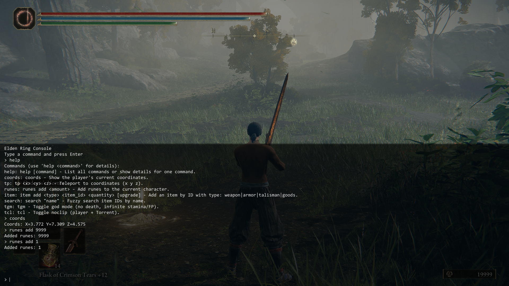

# Elden Ring Console

A console command implementation for Elden Ring, similar to Skyrim's.



Type `help` to see the available commands.

## Installation

First, install [me3](https://github.com/garyttierney/me3/releases/latest), then get the [latest release](https://github.com/AlpinDale/er_console/releases/latest) of this mod. Download the .zip file, extract it anywhere you want, and double-click on `er_console.me3` to launch the game.

## Building
Clone the repo and run:

```bash
cmake -S . -B build -G "Visual Studio 18 2026" -A x64
cmake --build build --config Release
```